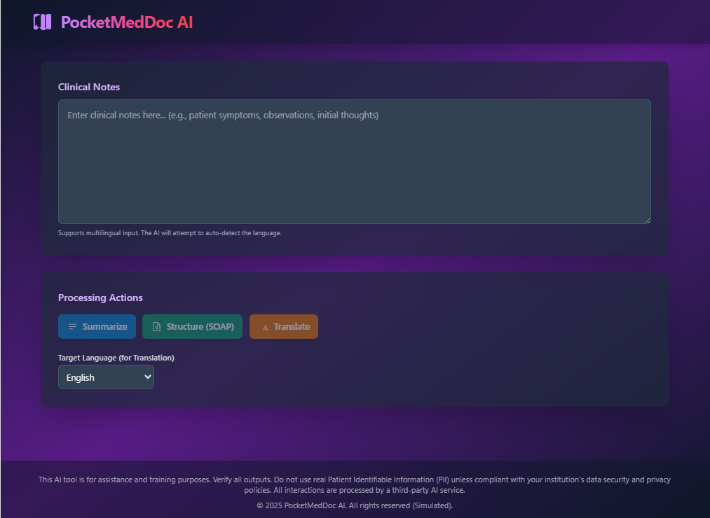
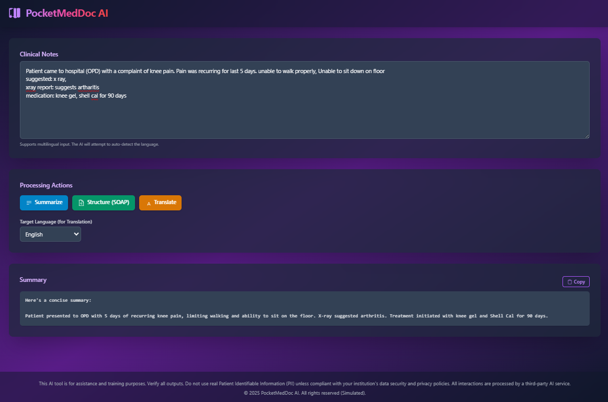

# PocketMedDoc AI - Developer Guide

PocketMedDoc AI is a secure, multilingual medical documentation assistant designed for clinicians. It aims to simplify and accelerate clinical documentation workflows, enabling quick note-taking and processing, even in high-pressure environments.

## Features

-   **Clinical Note Input:** Text area for entering free-form clinical notes.
-   **AI-Powered Processing:**
    -   **Summarize:** Generates concise summaries of notes.
    -   **Translate:** Translates notes into various supported languages.
    -   **Structure (SOAP):** Organizes notes into Subjective, Objective, Assessment, and Plan format.
-   **Multilingual Support:** Handles input and output in multiple languages.
-   **Grounding Information:** Displays web sources used by the AI for its responses, if applicable.
-   **Responsive UI:** Designed for usability on various screen sizes.
-   **Secure by Design:** Emphasizes privacy and security for sensitive healthcare data (though actual PII handling requires institutional compliance).

## Tech Stack

-   **Frontend:** React 18, TypeScript
-   **Styling:** Tailwind CSS
-   **AI Integration:** Google Gemini API (`@google/genai` SDK)
-   **Module System:** ES Modules directly in the browser (via import maps)

## Project Structure

```
.
├── public/
│   └── favicon.ico
├── src/
│   ├── components/
│   │   ├── common/         # Reusable UI components (Alert, Spinner)
│   │   ├── ActionToolbar.tsx
│   │   ├── Footer.tsx
│   │   ├── Header.tsx
│   │   ├── LanguageSelector.tsx
│   │   ├── NoteInput.tsx
│   │   └── OutputDisplay.tsx
│   ├── services/
│   │   └── geminiService.ts # Logic for Gemini API interaction
│   ├── App.tsx             # Main application component
│   ├── constants.ts        # Global constants (languages, API models)
│   ├── index.tsx           # React entry point
│   └── types.ts            # TypeScript type definitions
├── index.html              # Main HTML file
├── metadata.json           # Application metadata
├── README.md               # This file
└── USER_GUIDE.md           # Guide for end-users
```

## Getting Started

### Prerequisites

-   A modern web browser that supports ES Modules and Import Maps.
-   An active Google Gemini API key.

### Environment Variables

The application requires a Google Gemini API key to function. This key **must** be provided as an environment variable named `API_KEY`.

**Crucial:**
-   The application code in `services/geminiService.ts` directly attempts to read `process.env.API_KEY`.
-   **In a typical local development setup with a static `index.html` that directly loads ES modules, `process.env` might not be directly available in the browser as it is in a Node.js environment or when using bundlers like Webpack/Vite.**
-   To make the API key available, you will likely need to:
    1.  **Not recommended for production, but for simple local dev:** Manually replace `process.env.API_KEY` in `services/geminiService.ts` with your actual key *temporarily* during development. **Remember to never commit your API key to version control.**
    2.  **Better for local dev:** Serve `index.html` through a simple local development server that can inject environment variables or serve a JavaScript file that sets this global variable before `index.tsx` loads.
    3.  **Production/Deployment:** Your deployment environment (e.g., Vercel, Netlify, a custom server) will have its own mechanism for setting environment variables that can be accessed by server-side logic or injected into the client-side code during a build process (if a build process were added).

**The application itself does not provide a UI for entering the API key, nor should it. The key's availability is considered a prerequisite of the execution environment.**

### Running the Application

1.  Ensure you have a mechanism to provide the `API_KEY` as described above.
2.  Open the `index.html` file in your web browser.
    -   For features like `navigator.clipboard` (copy to clipboard) to work reliably, you might need to serve the `index.html` file over `http://localhost` rather than opening it directly as a `file:///` URL. You can use a simple HTTP server for this (e.g., `npx serve .` in the project root).

---

## Step-by-Step Guide

Follow these steps to use PocketMedDoc AI effectively:

### 1. Landing Page
When you open the application, you will see the landing page. This is where you can start entering your clinical notes.



### 2. Enter Clinical Notes
Type or paste your clinical notes into the text area labeled "Clinical Notes." You can write in various languages, and the AI will attempt to understand it.



### 3. Choose an Action
Below the notes input area, you will find "Processing Actions." Select one of the following actions:
- **Summarize:** Get a concise summary of your notes.
- **Structure (SOAP):** Organize your notes into the SOAP format (Subjective, Objective, Assessment, Plan).
- **Translate:** Translate your notes into a selected language.


### 4. View Processed Output
After selecting an action, the AI will process your notes. The processed text will appear in the "Processed Output" section. If the AI used external web pages for its response, these will be listed under "Information Sources."


### 5. Copy Output
Click the "Copy" button next to the "Processed Output" title to copy the text to your clipboard. You can then paste it into another application, such as your Electronic Health Record system.

---

## Troubleshooting

-   **"API Key not configured" / "Invalid API Key" errors:** Ensure the `API_KEY` is correctly set up and accessible as `process.env.API_KEY` in the environment where `geminiService.ts` is executed. See the "Environment Variables" section.
-   **CORS errors (if fetching API from client-side with a local server):** The Gemini API is typically called from a backend or a secure environment. If direct client-side calls are made in certain development setups, CORS policies might apply. The current setup uses `@google/genai` SDK which should handle this, but if you modify it to direct `fetch`, be aware.
-   **Functionality issues:** Check the browser's developer console for errors. Verify prompt construction in `geminiService.ts`.

This README provides a starting point for developers and end users. Ensure you adapt the "Environment Variables" and "Running the Application" sections to your specific development and deployment workflow.
